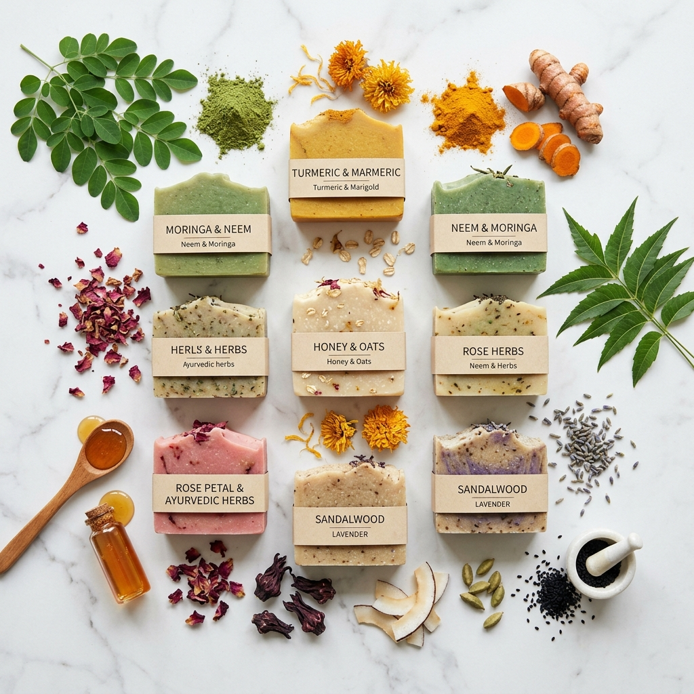

# 🌿 RAAS RATNA — Pure Nature. Pure Skin.

> A premium luxury Ayurvedic herbal soap brand website built with **Vite + React + Tailwind CSS + Framer Motion**.



---

## ✨ Features

- ⚡ **Vite + React** — Lightning fast development
- 🎨 **Tailwind CSS v3** — Custom brand color tokens (Forest Green, Honey Gold, Cream, Orange Peel)
- 🎬 **Framer Motion** — Premium animations everywhere
- 🌙 **Dark Mode** — Full dark/light theme toggle
- 📱 **Mobile Responsive** — Optimized for all screen sizes
- 🔍 **SEO Ready** — Meta tags, semantic HTML, structured content

## 📄 Pages & Sections

| Section | Description |
|---|---|
| 🏠 **Hero** | Full-screen parallax, floating soaps, leaf particles, animated scroll indicator |
| 💚 **About** | "Why Choose Raas Ratna?" — 6 animated feature cards |
| 🧼 **Products** | 4 premium handcrafted soap cards with Add to Cart |
| 🌱 **Benefits** | "Why Herbal Soap?" — dark forest section with icons & stats |
| ⭐ **Testimonials** | Luxury review cards with 5-star ratings |
| 📸 **Gallery** | Pinterest-style masonry grid with hover zoom |
| ❓ **FAQ** | Animated accordion with 8 questions |
| 📬 **Contact** | Form with Google Maps embed |
| 🔗 **Footer** | Logo, links, social icons, newsletter |

## 🎁 Extras

- 💬 Floating WhatsApp button (with pulse animation)
- ⬆️ Back-to-Top button
- 🌙 Dark Mode toggle
- ✨ Loading screen (animated logo)
- 🖱️ Cursor glow effect (desktop)
- 📊 Scroll progress bar

## 🚀 Getting Started

```bash
# Install dependencies
npm install

# Start development server
npm run dev

# Build for production
npm run build
```

Visit **http://localhost:5173** after starting the dev server.

## 🛠️ Tech Stack

- [Vite](https://vitejs.dev/)
- [React 19](https://react.dev/)
- [Tailwind CSS v3](https://tailwindcss.com/)
- [Framer Motion](https://www.framer.com/motion/)
- [React Icons](https://react-icons.github.io/react-icons/)
- [React Hot Toast](https://react-hot-toast.com/)

## 📁 Project Structure

```
src/
├── components/
│   ├── Navbar.jsx       # Glass navbar, scroll-aware, mobile drawer
│   ├── Hero.jsx         # Full-screen hero with parallax
│   ├── About.jsx        # Feature cards section
│   ├── Products.jsx     # Product grid
│   ├── ProductCard.jsx  # Individual product card
│   ├── Benefits.jsx     # Dark herbal benefits section
│   ├── Testimonials.jsx # Customer reviews
│   ├── Gallery.jsx      # Masonry image gallery
│   ├── FAQ.jsx          # Accordion FAQ
│   ├── Contact.jsx      # Contact form + map
│   └── Footer.jsx       # Site footer
├── pages/
│   └── Home.jsx         # Assembles all sections
├── hooks/
│   ├── useScrollProgress.js
│   └── useMouseGlow.js
├── animations/
│   └── variants.js      # Reusable Framer Motion variants
├── assets/images/       # AI-generated soap product images
├── App.jsx              # Root with loading screen & extras
└── index.css            # Global styles + Tailwind
```

## 🎨 Brand Colors

| Name | Hex |
|---|---|
| Forest Green | `#2D5016` |
| Honey Gold | `#D4A017` |
| Cream | `#FAF7F0` |
| Orange Peel | `#FF7043` |
| Charcoal | `#2C2C2C` |

## 📞 Contact

- **WhatsApp:** Update `919876543210` in `App.jsx`, `Footer.jsx`, `Contact.jsx`
- **Email:** Update `hello@raasratna.in` in `Footer.jsx`

---

Made with 🌿 in India · © 2024 RAAS RATNA
